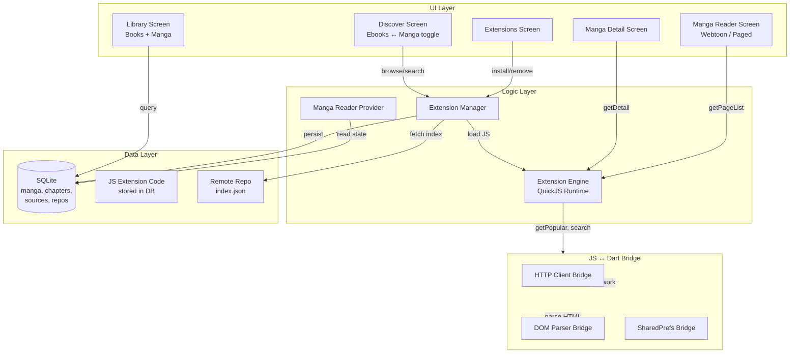

# Manga/Comic Plugin System — Tachiyomi-Style Extensions

Add a full manga/comic/manhwa reading experience with a JavaScript plugin system compatible with [Mangayomi extensions](https://github.com/kodjodevf/mangayomi-extensions). This enables users to browse, search, and read from hundreds of manga sources without app updates.

## User Review Required

> [!IMPORTANT]
> **This is a major feature addition (minor version bump → 2.5.0).** It adds:
> - A new JavaScript runtime engine to the app
> - 5 new database tables
> - An entirely new content type (image-based chapters vs text-based)
> - A new full-screen image reader
> - A new extension management UI
> - New dependencies: `flutter_js` (or `quickjs_engine`), `cached_network_image`

> [!WARNING]
> **Tachiyomi/Keiyoushi APK extensions are NOT directly compatible.** Those are compiled Kotlin Android APKs that require the Android class loader. Instead, we follow the **Mangayomi approach**: pure JavaScript extensions that implement the same logical API (`getPopular`, `getDetail`, `getPageList`, etc.) and run in a sandboxed QuickJS engine. This means:
> - ✅ Compatible with **Mangayomi JS extensions** out of the box
> - ✅ Cross-platform (Android, iOS, desktop)
> - ❌ Cannot load Keiyoushi `.apk` files directly (fundamentally different architecture)
> - The community maintains 100+ Mangayomi JS sources covering most popular manga sites

## Open Questions

> [!IMPORTANT]
> 1. **JS Engine choice:** `quickjs_engine` (QuickJS-NG, actively maintained, same engine everywhere) vs `flutter_js` (QuickJS on Android, JSC on iOS). I recommend **`flutter_js`** for its larger community and broader compatibility — is that okay?
> 2. **Extension repos:** Should we ship with the Mangayomi extensions repo URL pre-configured as a default source, or require the user to manually add repo URLs?
> 3. **Tab placement:** The current nav has 6 tabs (Library, History, Snippets, Discover, Search, Settings). Should manga browsing live inside the existing **Discover** tab (as a new content type toggle), or as a separate **Browse** tab? I recommend integrating it into Discover with a toggle.
> 4. **Manga library:** Should manga added from extensions go into the same Library tab as ebooks, or a separate "Manga" section? I recommend the same Library with a filter chip for content type.

## Proposed Changes

### Component 1: Dependencies & Config

#### [MODIFY] [pubspec.yaml](file:///Volumes/thezone/Documents/LNStash/pubspec.yaml)
Add new dependencies:
- `flutter_js: ^0.8.0` — QuickJS-based JavaScript engine for running extension scripts
- `cached_network_image: ^3.4.1` — Efficient image loading + caching for manga pages
- `photo_view: ^0.15.0` — Pinch-to-zoom for single-page reader mode

---

### Component 2: Data Layer — Models

#### [NEW] `lib/core/models/manga.dart`
New model for manga entries from extensions:
```dart
class Manga {
  final int id;
  final String name;
  final String url;           // relative URL on the source
  final String? imageUrl;     // cover image
  final String? author;
  final String? artist;
  final String? description;
  final int status;           // 0=ongoing, 1=completed, 2=hiatus, etc.
  final List<String> genres;
  final String sourceId;      // which extension source this came from
  final bool inLibrary;       // user added to library
  final DateTime? lastUpdate;
}
```

#### [NEW] `lib/core/models/manga_chapter.dart`
Chapter model for manga (distinct from ebook Chapter — carries URL, not content):
```dart
class MangaChapter {
  final int id;
  final int mangaId;
  final String name;
  final String url;            // chapter URL for page list fetching
  final String? scanlator;
  final int dateUpload;        // epoch millis
  final int index;
  final bool isRead;
  final int lastPageRead;
  final double scrollPosition;
}
```

#### [NEW] `lib/core/models/manga_page.dart`
Lightweight page reference (not stored in DB; fetched on-demand):
```dart
class MangaPage {
  final int index;
  final String imageUrl;
  final Map<String, String>? headers;  // referer, etc.
}
```

#### [NEW] `lib/core/models/extension_source.dart`
Represents an installed extension source:
```dart
class ExtensionSource {
  final String id;
  final String name;
  final String baseUrl;
  final String? apiUrl;
  final String lang;
  final String? iconUrl;
  final String version;
  final bool isManga;         // true=manga, false=anime (we only support manga)
  final String pkgPath;
  final bool isInstalled;
  final String? jsCode;       // the actual JavaScript code
}
```

#### [NEW] `lib/core/models/extension_repo.dart`
Extension repository URL:
```dart
class ExtensionRepo {
  final int id;
  final String name;
  final String url;  // URL to the index.json
  final bool enabled;
}
```

---

### Component 3: Data Layer — Database

#### [MODIFY] [database.dart](file:///Volumes/thezone/Documents/LNStash/lib/core/database/database.dart)
Add new tables in `_createTables()`:
- `manga` — stores manga that user has added to library
- `manga_chapters` — chapters per manga with read state + scroll position
- `extension_sources` — installed extension source metadata + JS code
- `extension_repos` — repo URLs for discovering extensions

#### [MODIFY] [database_service.dart](file:///Volumes/thezone/Documents/LNStash/lib/core/services/database_service.dart)
Add CRUD methods for the new tables:
- `insertManga`, `getManga`, `getMangaLibrary`, `updateManga`, `deleteManga`
- `insertMangaChapter`, `getMangaChapters`, `markChapterRead`, `updateMangaChapterProgress`
- `insertExtensionSource`, `getInstalledExtensions`, `removeExtension`
- `insertExtensionRepo`, `getExtensionRepos`, `removeRepo`

---

### Component 4: Extension Engine (Core Innovation)

#### [NEW] `lib/core/services/extension_engine.dart`
The JavaScript bridge — the heart of the plugin system:

```dart
class ExtensionEngine {
  /// Initialize a JS runtime with the extension's code loaded
  /// Inject Dart-side helpers:
  ///   - Client (HTTP): new Client().get(url, headers) → response
  ///   - Document (HTML parsing): new Document(html).select(selector)
  ///   - SharedPreferences: per-extension key-value store
  
  Future<MangaListResult> getPopular(int page);
  Future<MangaListResult> getLatestUpdates(int page);
  Future<MangaListResult> search(String query, int page);
  Future<MangaDetail> getDetail(String url);
  Future<List<MangaChapter>> getChapterList(String url);
  Future<List<MangaPage>> getPageList(String chapterUrl);
}
```

Key design decisions:
- **DOM selector bridge**: The Mangayomi JS extensions use `new Document(html).select("css-selector")` and `element.selectFirst()`, `.text`, `.getSrc`, `.getHref`. We implement these as Dart-side native bindings injected into the JS runtime.
- **HTTP bridge**: Extensions call `new Client().get(url, headers)` which delegates to Dart's `http` package, keeping cookies, user-agents, etc. controlled by the Dart side.
- **Sandboxing**: Each extension runs in its own JS context. No filesystem access, no arbitrary network — only through the injected bridges.

#### [NEW] `lib/core/services/extension_manager.dart`
Manages extension lifecycle:
```dart
class ExtensionManager {
  /// Fetch index.json from a repo URL, return available extensions
  Future<List<ExtensionSource>> fetchAvailableExtensions(String repoUrl);
  
  /// Download + install a JS extension (save code to DB)
  Future<void> installExtension(ExtensionSource source);
  
  /// Remove an extension
  Future<void> uninstallExtension(String sourceId);
  
  /// Get a running engine instance for a source
  ExtensionEngine getEngine(ExtensionSource source);
}
```

---

### Component 5: Image Reader (New Screen)

#### [NEW] `lib/features/manga_reader/manga_reader_screen.dart`
A purpose-built image reader supporting two modes:

**Webtoon mode (vertical scroll):**
- Continuous vertical `ListView.builder` with `CachedNetworkImage`
- Zero gap between images for seamless scrolling
- `cacheExtent: 2000` for prefetching
- Tap center for UI overlay, edges for page navigation

**Paged mode (horizontal swipe):**
- `PageView.builder` with `PhotoView` per page for pinch-to-zoom
- Left/right tap zones for page turn
- Slide-to-seek chapter bar

**Common features:**
- Chapter auto-advance (when scrolled to bottom of last image)
- Reading progress tracking (page-level)
- Chapter navigation drawer
- Settings: brightness, reading direction (LTR/RTL), background color
- Image download/save

#### [NEW] `lib/features/manga_reader/manga_reader_provider.dart`
State management for the manga reader:
- Current manga + chapter
- Page list loading/caching
- Read state persistence
- Chapter navigation

---

### Component 6: Browse/Discover UI

#### [MODIFY] [discover_screen.dart](file:///Volumes/thezone/Documents/LNStash/lib/features/discover/discover_screen.dart)
Add a **content type toggle** at the top (Ebooks | Manga). When "Manga" is selected:
- Show installed extension sources as a horizontal chip list
- Display popular manga from the selected source
- Search queries go through the extension engine
- Tapping a result opens manga detail view

#### [NEW] `lib/features/manga_detail/manga_detail_screen.dart`
The manga detail/info page (equivalent to Tachiyomi's manga detail):
- Cover image + title + author + status + description
- Genre tags
- "Add to Library" button
- Chapter list with read indicators
- Tap chapter → opens manga reader

---

### Component 7: Extension Management UI

#### [NEW] `lib/features/extensions/extensions_screen.dart`
Accessed from Settings. Shows:
- **Installed** tab: list of installed extensions with uninstall option
- **Available** tab: browse repo index, install new extensions
- **Repos** tab: manage extension repository URLs

#### [MODIFY] [settings_screen.dart](file:///Volumes/thezone/Documents/LNStash/lib/features/settings/settings_screen.dart)
- Add "Extensions" row in settings that navigates to extensions management
- Bump version to `2.5.0`

---

### Component 8: Library Integration

#### [MODIFY] [library_screen.dart](file:///Volumes/thezone/Documents/LNStash/lib/features/library/library_screen.dart)
- Add filter chips: "All" | "Books" | "Manga"
- Manga items show chapter count + unread badge
- Tapping a manga item opens manga detail, not the ebook reader

#### [MODIFY] [library_provider.dart](file:///Volumes/thezone/Documents/LNStash/lib/features/library/library_provider.dart)
- Add `loadManga()`, `getMangaLibrary()` methods
- Combine books + manga for unified display

---

### Component 9: Version Bump

#### [MODIFY] [pubspec.yaml](file:///Volumes/thezone/Documents/LNStash/pubspec.yaml)
Bump `version: 2.4.3+23` → `version: 2.5.0+24`

#### [MODIFY] [settings_screen.dart](file:///Volumes/thezone/Documents/LNStash/lib/features/settings/settings_screen.dart)
Bump version strings to `2.5.0`

---

## Architecture Diagram



## Verification Plan

### Automated Tests
```bash
# Run all unit tests after implementation
flutter test

# Run static analysis
dart analyze lib/
```

### Manual Verification
1. **Extension install flow**: Add the Mangayomi repo URL → browse available extensions → install MangaPill → see it in installed list
2. **Browse flow**: Switch Discover to Manga → select MangaPill source → see popular manga load with covers
3. **Search flow**: Type a query → see results from the extension
4. **Detail flow**: Tap a manga → see detail page with cover, description, chapter list
5. **Reader flow**: Tap a chapter → manga reader opens in webtoon mode → images load with scroll
6. **Reader modes**: Toggle between webtoon (vertical scroll) and paged (horizontal swipe + zoom)
7. **Library integration**: Add manga to library → see it in Library tab with "Manga" filter
8. **Progress tracking**: Read some chapters → close reader → reopen → resumes at correct chapter/page
